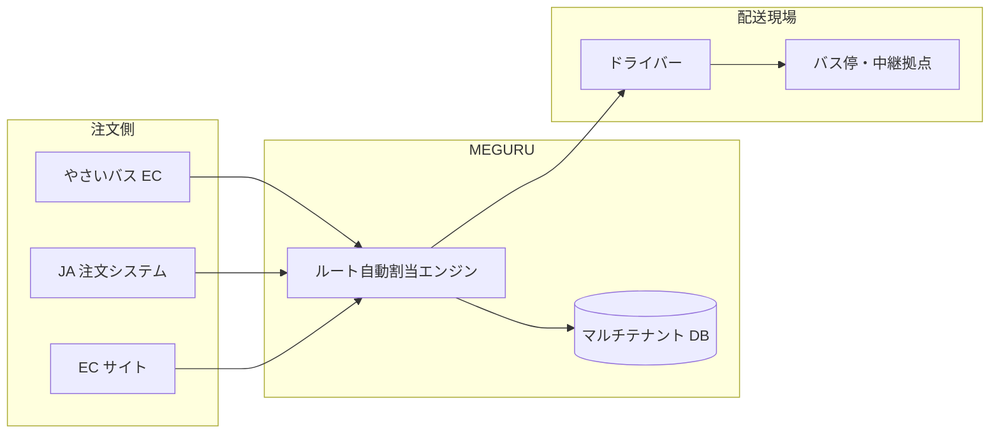
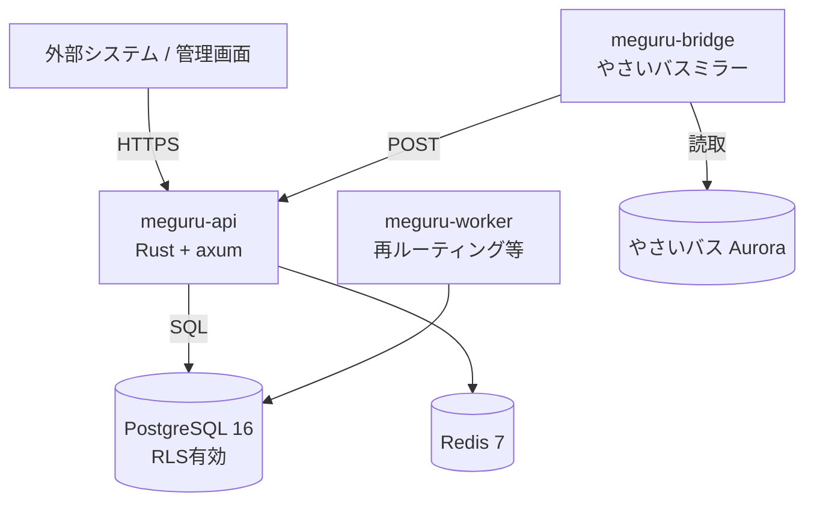
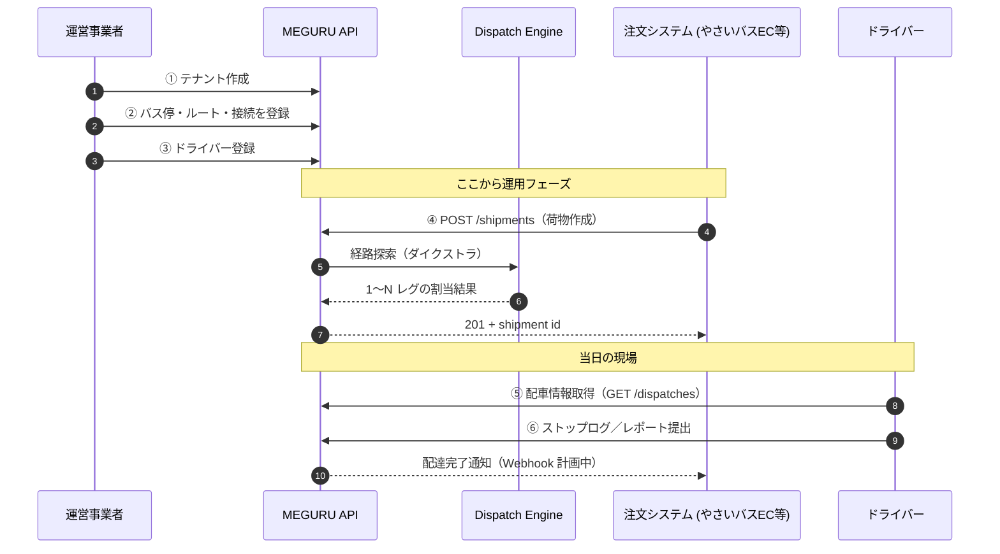

# 01. システム概要

📍 [目次](README.md) ▶ 01. システム概要

---

## 1.1 MEGURU とは

MEGURU は **地域の共同配送ネットワークをソフトウェアとして提供する SaaS プラットフォーム** です。

たとえば「やさいバス」の千葉エリアでは、農家・小売店・物流拠点を結ぶ配送ルートが組まれています。これと同じ仕組みを、エリアごと・運営事業者ごとに **箱（テナント）として切り出して提供** できるようにしたのが MEGURU です。



### 「やさいバス EC」と「MEGURU」の違い

| 観点 | やさいバス EC | MEGURU |
|---|---|---|
| 役割 | 受発注（誰が誰から何を買うか） | 配送（どう運ぶか） |
| 主体 | やさいバス株式会社 | 運営事業者（テナント）|
| データ | 注文・商品・取引 | バス停・ルート・荷物・配車 |
| API | EC 機能 | 配送インフラ機能 |
| DB | Aurora MySQL (`vegibus_new`) | PostgreSQL 16 (`meguru`) |

MEGURU は **注文を受け取って配送計画に落とす** ところを担当し、注文そのものは外部システム（やさいバス EC など）が握る、という分業です。

---

## 1.2 主要コンセプト

### バス停 (Stop)

集荷／配達／中継／車庫など、トラックが立ち寄る地点。

| 種別 | 意味 | 例 |
|---|---|---|
| `Collection` | 集荷専用 | 農家 |
| `Delivery` | 配達専用 | レストラン・スーパー |
| `Transit` | 中継拠点（積み替え） | 物流センター |
| `Both` | 集荷・配達兼用 | 道の駅・JA直売所 |
| `Garage` | 車庫 | やさいバス基地 |

### ストップ接続 (StopConnection)

「バス停 A から B に火・木・金で行ける」という **グラフの辺** にあたる情報。

```
[農家A] ──(火木金, 0日)──→ [中継X] ──(火木金, 0日)──→ [レストランB]
```

### ルート (Route)

順序付きのバス停の並び。1日のひとつの便（例：朝便、午後便）にあたります。

```
朝便（火木金 08:00 発, 冷蔵, 容量50ケース）:
  農家A → 農家B → 中継X
```

### 荷物 (Shipment)

「いつ・どこから・どこへ・何ケース運ぶか」の単位。MEGURU に POST すると **配車エンジンが自動でルートを割り当て** ます。

```
Pending → Confirmed → PickedUp → InTransit → Delivered
 受付      確定        集荷済    配送中       配達完了
                        ↓
                      Cancelled / Failed
```

### レグ (ShipmentLeg)

複数ルートをまたぐ荷物を区間単位に分割したもの。中継があると 2 つ以上のレグになります。

```
荷物：農家A → レストランC
  ├─ レグ1：農家A → 中継X（朝便, 0日）
  └─ レグ2：中継X → レストランC（午後便, 0日）
```

### テナント (Tenant)

1つの運営事業者の単位。データは PostgreSQL の Row Level Security（RLS）で完全に分離されます。

| プラン | 想定月額 | 想定規模 |
|---|---|---|
| Starter | 3万円 | 〜30 バス停 |
| Standard | 8万円 | 〜100 バス停 |
| Pro | 20万円 | 〜300 バス停 |
| Enterprise | 個別 | それ以上 |

---

## 1.3 アーキテクチャ

### コンポーネント



### コードレイアウト（4 クレート）

```
meguru/
├── crates/
│   ├── meguru-core/    # ドメインモデル＋配車エンジン（DB/HTTPに依存しない）
│   ├── meguru-api/     # HTTPサーバー（axum）
│   ├── meguru-infra/   # PostgreSQL リポジトリ層
│   ├── meguru-worker/  # バックグラウンドジョブ
│   └── meguru-bridge/  # やさいバス→MEGURUの片方向ミラー
├── migrations/         # SQL マイグレーション
├── docker-compose.yml  # ローカル開発環境
└── docs/manual/        # 本マニュアル
```

設計思想は **Clean Architecture**。ビジネスロジック（`meguru-core`）が DB や HTTP の詳細に依存しない構造です。テストが書きやすく、後で DB を切り替えるのも容易。

---

## 1.4 配車エンジン（Dispatch Engine）

MEGURU の中核。**ダイクストラ法**による最短経路探索を `petgraph` で実装しています。

### 何を最適化するか

エッジ（ストップ接続）は **4 次元のコスト** を持ちます：

| 次元 | フィールド | デフォルト最適化対象 |
|---|---|---|
| 配送日数 | `transit_days` | ✅ デフォルト |
| 距離 | `distance_m` | 任意 |
| 金額 | `cost_jpy` | 任意 |
| CO2 排出量 | `co2_g` | Scope3 対応に向けて準備中 |

`CostMetric` enum で切替可能：

```rust
// 最速ルート（デフォルト）
engine.assign(tenant, origin, dest, date, container, CostMetric::TransitDays);

// 最低 CO2 ルート（カーボンニュートラル要件があるテナント向け）
engine.assign(tenant, origin, dest, date, container, CostMetric::Co2);
```

### 何ができないか（重要）

- ❌ **車両ルート最適化（VRP）はしません**。 ルート（朝便など）は人が決めるもの。MEGURU はあくまで「どのルートに乗せるか」を決めるだけ。
- ❌ **リアルタイム交通情報** は見ません。 `transit_days` は静的データ。
- ❌ **積載シミュレーション** は単純な「ケース数 vs 容量」のみ。容積・重量の細かい最適化はしない。

---

## 1.5 認証・認可

| 方式 | 対象 | 用途 |
|---|---|---|
| **JWT** | 管理者・ドライバー | ログイン後の API 操作 |
| **API キー** | 荷主（外部システム） | サーバ間連携 |

開発中は `MEGURU_API_KEY=dev-noauth` で実質的に認証をバイパスできます。本番運用前に必ず差し替えてください。

詳細は [04_shipper_guide.md](04_shipper_guide.md) と [09_api_reference.md#認証](09_api_reference.md#認証) を参照。

---

## 1.6 マルチテナント

| 仕組み | 説明 |
|---|---|
| **全テーブルに `tenant_id`** | スキーマレベルで分離前提 |
| **PostgreSQL RLS** | DB レベルで他テナントのデータが SELECT で見えない |
| **`app.tenant_id` セッション変数** | API がリクエストごとに現在のテナントを設定 |

```sql
-- 例: stops テーブルの RLS ポリシー
CREATE POLICY tenant_isolation ON stops
  USING (tenant_id = current_setting('app.tenant_id')::uuid);
```

→ コード側でうっかり `WHERE tenant_id =` を書き忘れても、他テナントのデータは返らない。**設計上の安全装置** です。

---

## 1.7 現在の開発フェーズ

### Phase 1（MVP）— ✅ 完了

- テナント／ドライバー／バス停／ルート CRUD
- ストップ接続（一括登録含む）
- 配車エンジン（petgraph ルーティング）
- 荷物作成と自動ルーティング
- キャンセルと連鎖処理
- JWT / API キー認証
- PostgreSQL RLS

### Phase 1.5（シャドウ検証）— 🟡 進行中（**2026-05 時点ここ**）

- やさいバス本番（Aurora）から MEGURU（Postgres）への片方向ミラー
- 千葉エリア（158 バス停）で実データを使った配車予測検証
- 詳細：[06_shadow_testing.md](06_shadow_testing.md)

### Phase 2 — 計画中

- 料金エンジン本実装
- Webhook 通知
- ヤマト運輸プラグイン
- ドライバー画面（モバイル）

---

## 1.8 ユースケース全景



---

## 1.9 関連ドキュメント

- [docs/MEGURU_system_overview.md](../MEGURU_system_overview.md) — 旧概要
- [docs/product_vision.md](../product_vision.md) — プロダクトビジョン
- [docs/bridge_mapping.md](../bridge_mapping.md) — やさいバス→MEGURU カラム対応表
- [MEGURU_architecture_spec_v4.1.md](../../../MEGURU_architecture_spec_v4.1.md) — アーキテクチャ完全仕様

---

次は [02_quickstart.md](02_quickstart.md) で実際に起動してみてください。
