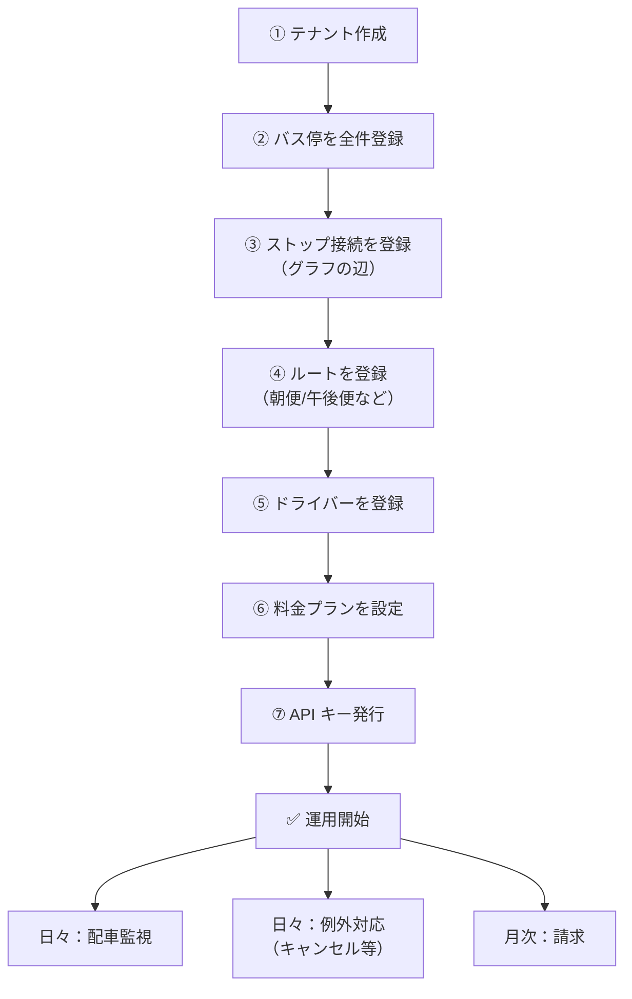

# 03. 管理者ガイド（テナント運営者向け）

📍 [目次](README.md) ▶ 03. 管理者ガイド

このページの読者：MEGURU を **運営する事業者の担当者**（運営事業者の管理画面ユーザー、あるいは構築を代行する SIer）。

ここでは、テナントを箱として受け取った直後の **ゼロから運用開始までの初期設定** と、**日常運用時の操作** を扱います。

🎥 **動画候補**：3.2〜3.5 を 10〜15 分で通し撮り

---

## 3.1 全体フロー



ステップ ①〜⑦ は **初期設定（テナント立ち上げ時のみ）**。⑧ 以降は日々の運用です。

---

## 3.2 ① テナント作成

> このステップは **M2Labo 側** で実施（運営事業者から依頼を受けて）。本番では別管理画面化予定。

```bash
curl -s -X POST http://localhost:3000/admin/tenants \
  -H 'Content-Type: application/json' \
  -H 'X-API-Key: <admin-key>' \
  -d '{"name":"〇〇地域コミュニティ配送","plan":"standard"}'
```

返ってきた `id` が **以降ずっと使うテナントID** です。運営事業者にメール等で安全に共有してください。

| プラン | バス停数の目安 | 機能差 |
|---|---|---|
| `starter` | 〜30 | 基本機能 |
| `standard` | 〜100 | + Webhook |
| `pro` | 〜300 | + 高度な料金エンジン |
| `enterprise` | 制限なし | + SLA |

無効化したいときは：

```bash
curl -X PATCH http://localhost:3000/admin/tenants/$TENANT \
  -H 'Content-Type: application/json' \
  -H 'X-API-Key: <admin-key>' \
  -d '{"active":false}'
```

---

## 3.3 ② バス停を全件登録

### 方針

1. **車庫（Garage）から登録**：拠点が決まる
2. **中継拠点（Transit）を登録**：物流ハブを先に
3. **集荷拠点（Collection）と配達拠点（Delivery）を登録**：その地域の農家・店舗
4. **Both 型**：直売所など兼用拠点

### CSV 一括登録のひな型

> 現在は単発の `POST /stops` のみ。Bulk は未実装（[次期対応予定](../MANUAL.md#1-機能一覧)）。
> 当面は以下のようなシェル一発で投入する：

```bash
#!/bin/bash
# stops.csv: name,address,lat,lng,stop_type,capacity
while IFS=, read -r name address lat lng stop_type capacity; do
  curl -s -X POST "http://localhost:3000/stops?tenant_id=$TENANT" \
    -H 'Content-Type: application/json' -H 'X-API-Key: '"$KEY"'' \
    -d "$(jq -n --arg n "$name" --arg a "$address" \
            --argjson lat $lat --argjson lng $lng \
            --arg t "$stop_type" --argjson c $capacity \
            '{name:$n,address:$a,latitude:$lat,longitude:$lng,stop_type:$t,capacity_cases:$c}')"
done < stops.csv
```

### バス停種別の選び方

| 拠点の実態 | 種別 |
|---|---|
| 集荷だけ（農家・JA直売所など）| `collection` |
| 配達だけ（スーパー・レストラン）| `delivery` |
| 集荷も配達もする（道の駅）| `both` |
| ドライバー交替・積替のみ（中継センター）| `transit` |
| 車両拠点（やさいバス本部）| `garage` |

> 💡 やさいバスでは **mtb_bus_stop の 4 フラグ全 0** は「実質非可視のダミー扱い」になりますが、MEGURU 側では `both` にフォールバックしています。詳細は [docs/bridge_mapping.md](../bridge_mapping.md)。

---

## 3.4 ③ ストップ接続（グラフの辺）

「バス停 A から B に、何曜日に行けるか」をすべて登録します。これが配車エンジンの根拠データです。

### 単発登録

```bash
curl -X POST "http://localhost:3000/connections?tenant_id=$TENANT" \
  -H 'Content-Type: application/json' -H 'X-API-Key: '"$KEY"'' \
  -d '{
    "from_stop_id":"...",
    "to_stop_id":"...",
    "days_of_week":["tue","thu","fri"],
    "transit_days":0,
    "distance_m":15000,
    "cost_jpy":300,
    "co2_g":2400,
    "active_from":"2026-04-01",
    "active_until":null
  }'
```

| フィールド | 必須 | 説明 |
|---|---|---|
| `from_stop_id` / `to_stop_id` | ✅ | 始点・終点 |
| `days_of_week` | ✅ | `["mon","tue",...]` |
| `transit_days` | ✅ | 当日 = 0、翌日 = 1 |
| `distance_m` | 任意 | コスト最適化で使う |
| `cost_jpy` | 任意 | 同上 |
| `co2_g` | 任意 | Scope3 集計用 |
| `active_from` | ✅ | 適用開始日 |
| `active_until` | 任意 | 適用終了日（無期限なら null）|

### 一括登録

接続は数が多いので **bulk が現実的**：

```bash
curl -X POST "http://localhost:3000/connections/bulk?tenant_id=$TENANT" \
  -H 'Content-Type: application/json' -H 'X-API-Key: '"$KEY"'' \
  -d '{"connections":[ {...}, {...}, ... ]}'
```

### 接続データの設計指針

- **双方向は 2 件で登録**：A→B と B→A は別エッジ
- **車庫からは出発／到着エッジ**：朝出庫・夜帰庫
- **transit_days=1** は翌朝便を表現（夜便で中継泊）

---

## 3.5 ④ ルート登録

```bash
curl -X POST "http://localhost:3000/routes?tenant_id=$TENANT" \
  -H 'Content-Type: application/json' -H 'X-API-Key: '"$KEY"'' \
  -d '{
    "name":"千葉朝便",
    "days_of_week":["mon","wed","fri"],
    "departure_time":"07:00:00",
    "temperature":"refrigerated",
    "capacity_cases":80,
    "stops":["<stop_id_1>","<stop_id_2>","<stop_id_3>"]
  }'
```

| フィールド | 説明 |
|---|---|
| `name` | 「千葉朝便」「東京戻り便」など人が読む名前 |
| `days_of_week` | 運行曜日 |
| `departure_time` | 出発時刻（`HH:MM:SS`）|
| `temperature` | `ambient` / `refrigerated` / `frozen` |
| `capacity_cases` | ケース数上限 |
| `stops` | 立ち寄り順の **配列**（必ず順序を保つ）|

### ルートの追加・変更・廃止

```bash
# 内容変更
curl -X PATCH http://localhost:3000/routes/$ROUTE_ID \
  -H 'Content-Type: application/json' -H 'X-API-Key: '"$KEY"'' \
  -d '{"capacity_cases":100}'

# 廃止（実際は DELETE で論理削除扱い）
curl -X DELETE http://localhost:3000/routes/$ROUTE_ID \
  -H 'X-API-Key: '"$KEY"''
```

> 🔴 **ルートを変更すると、未配送の荷物が自動で再ルーティング** されます（`meguru-worker` の reroute ジョブ）。事前に影響範囲を確認してください。

---

## 3.6 ⑤ ドライバー登録

```bash
curl -X POST "http://localhost:3000/drivers?tenant_id=$TENANT" \
  -H 'Content-Type: application/json' -H 'X-API-Key: '"$KEY"'' \
  -d '{"name":"山田太郎","phone":"090-1234-5678"}'
```

| フィールド | 説明 |
|---|---|
| `name` | ドライバー名 |
| `phone` | 連絡先（任意） |
| `active` | デフォルト true |

ドライバーアプリ（モバイル）は Phase 2。詳細は [05_driver_guide.md](05_driver_guide.md)。

---

## 3.7 ⑥ 料金プラン設定

> 🟡 **Phase 2 機能**。現状は DB に直接 INSERT。

DB スキーマ：

```sql
INSERT INTO tenant_pricing
(tenant_id, name, base_fee_per_case, size_multipliers, cross_area_fee, active_from)
VALUES (
  '<tenant_id>',
  '2026年度料金',
  300,                                      -- 1ケースあたり300円
  '{"small":1.0,"medium":1.5,"large":2.0,"xlarge":2.5,"xxlarge":3.0}'::jsonb,
  500,                                      -- エリアまたぎ追加料金
  '2026-04-01'
);
```

特定荷主への割引：

```sql
INSERT INTO shipper_discounts
(tenant_id, shipper_id, discount_rate, active_from)
VALUES ('<tenant_id>', '<shipper_uuid>', 0.10, '2026-04-01');  -- 10%引
```

---

## 3.8 ⑦ API キー発行（荷主向け）

> 🟡 現在は dev-noauth キーで全機能アクセス可能。本番運用前にここを実装する必要あり。

設計上の対応関係：

| 種別 | 認証ヘッダ | 対象 |
|---|---|---|
| Admin JWT | `Authorization: Bearer <jwt>` | 管理者画面 |
| Driver JWT | `Authorization: Bearer <jwt>` | ドライバーアプリ |
| Shipper API キー | `X-API-Key: <key>` | 外部システム連携 |

API キー発行手順は [04_shipper_guide.md#APIキー発行](04_shipper_guide.md#APIキー発行) を参照。

---

## 3.9 日常運用：配車監視

### 今日の荷物一覧

```bash
curl -s "http://localhost:3000/shipments?tenant_id=$TENANT" \
  -H 'X-API-Key: '"$KEY"'' \
  | jq '.[] | select(.scheduled_date == "2026-05-13")'
```

### ステータス別カウント

```bash
curl -s "http://localhost:3000/shipments?tenant_id=$TENANT" \
  -H 'X-API-Key: '"$KEY"'' \
  | jq 'group_by(.status) | map({status:.[0].status,count:length})'
```

期待出力：

```json
[
  {"status":"pending","count":12},
  {"status":"confirmed","count":3},
  {"status":"delivered","count":42},
  {"status":"cancelled","count":1}
]
```

### 異常検知のサイン

| サイン | 意味 | 対処 |
|---|---|---|
| `status=pending` が当日午前まで多数残る | 配車されていない | ルート未登録／接続切れの可能性。`/connections` を確認 |
| `status=failed` が増える | エンジンが経路を見つけられない | 該当荷物の `external_order_id` から原因特定 |
| 特定ルートだけ容量超え | 荷物が偏った | ルート増便 or ストップ接続を別ルートに振り分け |

---

## 3.10 例外対応

### 急なルート運休

ルートを `active=false` にして、その日の荷物を `cancel` するか、別ルートで再投入：

```bash
# 1. ルート無効化
curl -X PATCH http://localhost:3000/routes/$ROUTE_ID \
  -H 'Content-Type: application/json' -H 'X-API-Key: '"$KEY"'' \
  -d '{"active":false}'

# 2. 影響を受けた未配送 shipment をキャンセル
for sid in $(curl -s "http://localhost:3000/shipments?tenant_id=$TENANT" -H 'X-API-Key: '"$KEY"'' \
  | jq -r '.[] | select(.status=="pending") | .id'); do
    curl -X PATCH "http://localhost:3000/shipments/$sid/cancel" -H 'X-API-Key: '"$KEY"''
done
```

### バス停の一時休止

接続を `active_until` で切る：

```sql
UPDATE stop_connections SET active_until = '2026-05-13'
WHERE tenant_id = '<TENANT>' AND (from_stop_id = '<STOP>' OR to_stop_id = '<STOP>');
```

---

## 3.11 月次：請求

> 🟡 Phase 2 機能。現状は SQL で集計：

```sql
SELECT
  COUNT(*) AS shipments,
  SUM(cases) AS total_cases,
  SUM(cases * 300) AS revenue_jpy  -- 仮料金
FROM shipments
WHERE tenant_id = '<TENANT>'
  AND status = 'delivered'
  AND scheduled_date BETWEEN '2026-04-01' AND '2026-04-30';
```

---

## 3.12 トラブル時に最初に見る場所

1. `GET /health` でサーバ生存を確認
2. `tenants.active = true` か確認
3. `stops`, `routes`, `stop_connections` の件数が想定通りか
4. アプリログ（`RUST_LOG=info`）に `ERROR` が出ていないか
5. それでも分からなければ [08_operator_guide.md](08_operator_guide.md)

---

次：荷主・外部システム連携の手順は [04_shipper_guide.md](04_shipper_guide.md) を参照。
