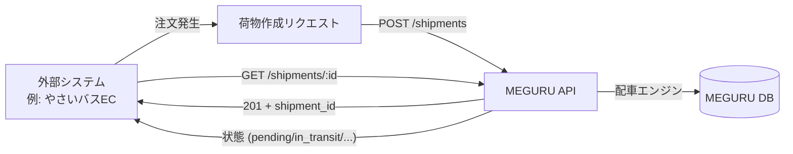
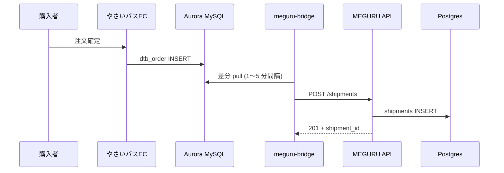

# 04. 荷主・連携ガイド（外部システム向け）

📍 [目次](README.md) ▶ 04. 荷主ガイド

このページの読者：**やさいバス EC** や **JA 注文システム**、各種 EC サイトから MEGURU に荷物を投入する **外部システム開発者** および **荷主としての利用者**。

🎥 **動画候補**：4.3〜4.6 を一連でデモ（7〜10 分）

---

## 4.1 概念整理



外部システムが担うのは：

1. 注文発生時に **荷物を MEGURU に登録**（POST）
2. 注文画面で **配送状況を確認**（GET）
3. 注文取消時に **荷物をキャンセル**（PATCH）

それ以外（バス停／ルート／ドライバー）は **テナント管理者が事前に登録済み** の前提です。

---

## 4.2 認証

### API キー方式

外部システム向けは **API キー認証** が標準です。

```http
POST /shipments HTTP/1.1
Host: meguru.example.com
X-API-Key: mg_live_abc123...
Content-Type: application/json
```

### API キー発行

> 🟡 Phase 2 機能。現在は dev-noauth で代用。

将来：

```bash
# テナント管理者が発行
curl -X POST http://meguru.example.com/admin/api-keys?tenant_id=$TENANT \
  -H 'Authorization: Bearer <admin-jwt>' \
  -d '{"name":"やさいバスEC本番","scopes":["shipments:write","shipments:read"]}'
```

→ レスポンスに **平文キーは一度だけ表示**（DB には hash 保存）。安全な場所に保管してください。

### キーローテーション

- 半年に 1 度を推奨
- 旧キーは新キー発行から 30 日間は併存可能
- 流出懸念があれば即時失効：`PATCH /admin/api-keys/:id` で `active:false`

---

## 4.3 荷物作成（POST /shipments）

### リクエスト

```http
POST /shipments?tenant_id=<TENANT>
X-API-Key: <KEY>
Content-Type: application/json

{
  "origin_stop_id": "<出発バス停の UUID>",
  "destination_stop_id": "<到着バス停の UUID>",
  "scheduled_date": "2026-05-13",
  "cases": 3,
  "container_size": "medium",
  "temperature": "refrigerated",
  "external_order_id": "yasai-12345"
}
```

| フィールド | 必須 | 説明 | 取りうる値 |
|---|---|---|---|
| `origin_stop_id` | ✅ | 出発地バス停 | UUID |
| `destination_stop_id` | ✅ | 到着地バス停 | UUID |
| `scheduled_date` | ✅ | 配送希望日 | `YYYY-MM-DD` |
| `cases` | ✅ | ケース数 | 正の整数 |
| `container_size` | ✅ | コンテナサイズ | `small`/`medium`/`large`/`xlarge`/`xxlarge` |
| `temperature` | 任意 | 温度帯 | `ambient`/`refrigerated`/`frozen` |
| `external_order_id` | 推奨 | 外部システム側の注文 ID（冪等鍵）| 任意文字列 |

### レスポンス（成功 = 201）

```json
{
  "id": "f1e2d3c4-...",
  "tenant_id": "01a2b3c4-...",
  "external_order_id": "yasai-12345",
  "origin_stop_id": "...",
  "destination_stop_id": "...",
  "scheduled_date": "2026-05-13",
  "cases": 3,
  "container_size": "medium",
  "temperature": "refrigerated",
  "status": "pending",
  "legs": [
    {
      "id": "...",
      "leg_order": 1,
      "route_id": "...",        // 朝便
      "from_stop_id": "...",
      "to_stop_id": "...",       // 中継X
      "scheduled_date": "2026-05-13",
      "status": "pending"
    },
    {
      "id": "...",
      "leg_order": 2,
      "route_id": "...",        // 午後便
      "from_stop_id": "...",     // 中継X
      "to_stop_id": "...",
      "scheduled_date": "2026-05-13",
      "status": "pending"
    }
  ]
}
```

### エラー（422 = 経路なし）

```json
HTTP/1.1 422 Unprocessable Entity
{"error":"no path found from <origin> to <destination> on 2026-05-13"}
```

→ 原因はだいたい：

- そもそも接続が登録されていない
- その曜日に運行するルートがない
- `active_until` が過ぎている
- 出発地・到着地のバス停 ID が誤っている

詳細は [07_test_scenarios.md#エラーパターン](07_test_scenarios.md#エラーパターン) を参照。

### 冪等性

同じ `external_order_id` で再 POST しても **重複作成されません**（新規挿入ではなく既存レコードを返す設計予定 / 現状は重複を弾く実装）。

→ ネットワーク不通でリトライしても安全。

---

## 4.4 荷物照会（GET）

### 単一荷物

```bash
curl -s http://meguru.example.com/shipments/$SHIPMENT_ID \
  -H 'X-API-Key: '"$KEY"''
```

### 一覧

```bash
curl -s "http://meguru.example.com/shipments?tenant_id=$TENANT" \
  -H 'X-API-Key: '"$KEY"''
```

> 🟡 現状はテナント単位の全件返却。日付・ステータス・荷主のフィルタは Phase 2。

### ステータスの意味

| status | 意味 | 次の状態 |
|---|---|---|
| `pending` | 受付済（未確定） | `confirmed` / `cancelled` |
| `confirmed` | 配車確定 | `picked_up` / `cancelled` |
| `picked_up` | 集荷完了 | `in_transit` / `delivered` |
| `in_transit` | 中継輸送中 | `delivered` / `failed` |
| `delivered` | 配達完了 | — |
| `cancelled` | キャンセル済 | — |
| `failed` | 失敗 | 手動オペで対応 |

---

## 4.5 荷物キャンセル（PATCH）

```bash
curl -X PATCH http://meguru.example.com/shipments/$SHIPMENT_ID/cancel \
  -H 'X-API-Key: '"$KEY"''
```

### キャンセル可否

| 現ステータス | キャンセル可否 |
|---|---|
| `pending` | ✅ 可 |
| `confirmed` | ✅ 可 |
| `picked_up` | ❌ 不可（既にトラックに乗った）|
| `in_transit` | ❌ 不可 |
| `delivered` | ❌ 不可 |
| `cancelled` | ❌ 既にキャンセル済 |

不可の場合は HTTP 422：

```json
{"error":"Shipment cannot be cancelled (not found or already picked up)"}
```

### 副作用

- `shipment_legs` も連鎖して `cancelled` に
- `shipment_reports` は残る（履歴として）

---

## 4.6 Webhook 通知（計画中）

🟡 Phase 2

```http
POST <your-webhook-url>
X-MEGURU-Signature: sha256=...
Content-Type: application/json

{
  "event":"shipment.delivered",
  "shipment_id":"f1e2d3c4-...",
  "external_order_id":"yasai-12345",
  "delivered_at":"2026-05-13T15:42:11+09:00"
}
```

イベント一覧：

| event | タイミング |
|---|---|
| `shipment.created` | POST /shipments 直後 |
| `shipment.confirmed` | 配車確定（前日）|
| `shipment.picked_up` | ドライバーが集荷ログ |
| `shipment.in_transit` | 中継拠点出発 |
| `shipment.delivered` | 配達完了 |
| `shipment.cancelled` | キャンセル |
| `shipment.failed` | 配達失敗 |

---

## 4.7 やさいバスから MEGURU に乗り換える場合

やさいバス EC を使いつつ、配送だけ MEGURU で動かす場合の連携イメージ：



実装の対応関係：

| やさいバス側 | MEGURU 側 |
|---|---|
| `dtb_order.id` | `shipments.external_order_id` |
| `mtb_bus_stop.id` | `bridge_stop_links` で UUID にマッピング |
| `order_status_id` (1-13) | `shipments.status` (7 値) に変換 |
| `container_size_id` (1-5) | `shipments.container_size` (small〜xxlarge) |

詳細マッピング表：[docs/bridge_mapping.md](../bridge_mapping.md)

---

## 4.8 サンプルコード

### Python

```python
import requests, os

API = "https://meguru.example.com"
KEY = os.environ["MEGURU_API_KEY"]
TENANT = "01a2b3c4-..."

def create_shipment(order):
    resp = requests.post(
        f"{API}/shipments",
        params={"tenant_id": TENANT},
        headers={"X-API-Key": KEY, "Content-Type": "application/json"},
        json={
            "origin_stop_id": order["farmer_stop_id"],
            "destination_stop_id": order["buyer_stop_id"],
            "scheduled_date": order["pickup_date"].isoformat(),
            "cases": order["case_count"],
            "container_size": order["size"],
            "temperature": "refrigerated",
            "external_order_id": str(order["id"]),
        },
        timeout=30,
    )
    resp.raise_for_status()
    return resp.json()
```

### TypeScript

```typescript
const API = process.env.MEGURU_API!;
const KEY = process.env.MEGURU_API_KEY!;
const TENANT = process.env.MEGURU_TENANT!;

export async function createShipment(o: Order) {
  const res = await fetch(`${API}/shipments?tenant_id=${TENANT}`, {
    method: "POST",
    headers: { "X-API-Key": KEY, "Content-Type": "application/json" },
    body: JSON.stringify({
      origin_stop_id: o.farmerStopId,
      destination_stop_id: o.buyerStopId,
      scheduled_date: o.pickupDate,
      cases: o.cases,
      container_size: o.size,
      temperature: "refrigerated",
      external_order_id: o.id.toString(),
    }),
  });
  if (!res.ok) throw new Error(`MEGURU ${res.status}: ${await res.text()}`);
  return res.json();
}
```

---

## 4.9 トラブル時のチェックリスト

| 症状 | 確認順序 |
|---|---|
| 401 | API キーヘッダ名は `X-API-Key`、キー文字列が完全一致するか |
| 404（POST 時）| URL の `tenant_id=` クエリが付いているか |
| 422 "no path found" | `GET /connections?tenant_id=` で接続が存在するか |
| 422 "container size invalid" | enum 値が `small`/`medium`/`large`/`xlarge`/`xxlarge` のいずれかか |
| 500 | サーバ側ログを確認（[08_operator_guide.md](08_operator_guide.md)）|

---

次：ドライバー業務フローは [05_driver_guide.md](05_driver_guide.md)。
