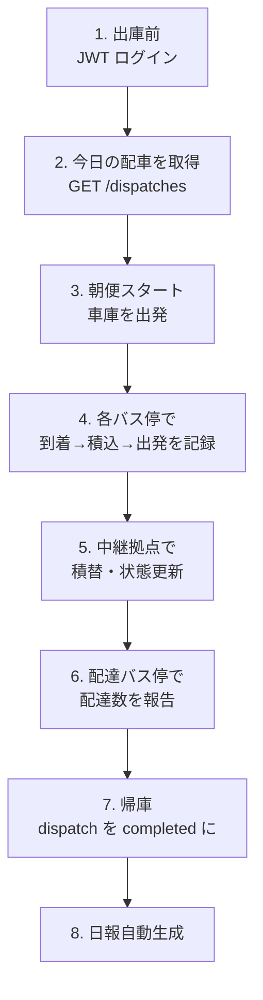

# 05. ドライバーガイド（現場業務）

📍 [目次](README.md) ▶ 05. ドライバーガイド

このページの読者：**MEGURU を使って実際に集荷・配達するドライバー** および ドライバーアプリを開発するエンジニア。

> ⚠️ ドライバーアプリ（モバイル UI）は **Phase 2** です。現状は API のみが存在し、画面はテナント側で開発する想定です。本ガイドは **API 仕様＋業務フロー** を中心に書きます。

🎥 **動画候補**：5.4 の一日の流れを実車に同乗して撮影（15 分）

---

## 5.1 ドライバーから見た一日



---

## 5.2 ログイン（JWT 取得）

```http
POST /auth/login HTTP/1.1
Content-Type: application/json

{
  "tenant_id": "01a2b3c4-...",
  "role": "driver"
}
```

レスポンス：

```json
{"token":"eyJhbGc..."}
```

このトークンを以降 `Authorization: Bearer <token>` で送る。

> 🟡 現状はパスワード検証なし（MVP）。本番運用前にユーザー管理を実装。

---

## 5.3 今日の配車を取得

> 🟡 `GET /dispatches?driver_id=...&date=...` は未実装。現状は管理者画面・DB から確認。

将来の API イメージ：

```bash
curl -s "http://meguru.example.com/dispatches?driver_id=$DRIVER&date=2026-05-13" \
  -H "Authorization: Bearer $JWT"
```

```json
[
  {
    "id": "...",
    "route_id": "...",
    "route_name": "千葉朝便",
    "departure_time": "08:00:00",
    "status": "scheduled",
    "stops": [
      {
        "stop_id":"...","name":"農家A","sequence":1,
        "shipments":[{"id":"...","cases":3,"action":"pickup"}]
      },
      {
        "stop_id":"...","name":"中継X","sequence":2,
        "shipments":[
          {"id":"...","cases":3,"action":"drop"},
          {"id":"...","cases":5,"action":"pickup"}
        ]
      }
    ]
  }
]
```

---

## 5.4 各バス停での操作

### 到着時：StopLog 開始

```http
POST /stop-logs
Authorization: Bearer <jwt>
{
  "dispatch_id": "...",
  "stop_id": "...",
  "arrived_at": "2026-05-13T08:15:00+09:00"
}
```

### 集荷／配達ごとの個別報告：ShipmentReport

```http
POST /shipment-reports
Authorization: Bearer <jwt>
{
  "dispatch_id": "...",
  "stop_id": "...",
  "shipment_id": "...",
  "cases_reported": 3,
  "report_type": "pickup"
}
```

`report_type`:

| 値 | 意味 |
|---|---|
| `pickup` | 集荷した |
| `delivery` | 配達完了 |

### 出発時：StopLog 完了

```http
PATCH /stop-logs/:id
{
  "departed_at": "2026-05-13T08:25:00+09:00",
  "cases_loaded": 5,
  "cases_unloaded": 2
}
```

このタイミングで MEGURU 内部では：

- 該当 shipment の status を `pickup` 時に `picked_up` へ
- 中継拠点で積替時に `in_transit` へ
- 最終配達 stop で `delivery` 報告時に `delivered` へ

---

## 5.5 中継拠点での積替

中継（Transit）バス停での扱いは少し特殊：

```
朝便ドライバー  →  中継X (積み下ろし)  →  午後便ドライバー
                       ↑
                  ここで shipment は
                  「leg1 完了 / leg2 待機」
                  状態に変わる
```

操作上は **同じ shipment_id に対して、朝便ドライバーが `delivery` 報告、午後便ドライバーが `pickup` 報告** をします。MEGURU 側はレグ毎に状態遷移を追跡。

---

## 5.6 例外対応

### 集荷時：荷物がない／数量違い

```bash
# 0 ケースで報告すると失敗扱い
POST /shipment-reports
{
  "shipment_id":"...",
  "cases_reported":0,
  "report_type":"pickup",
  "note":"農家不在で集荷できず"
}
```

→ MEGURU は shipment を `failed` に更新（仕様予定）。

### 配達時：受取人不在

→ 別途「再配達」フロー（Phase 2）。現状は手動で `cancel` → 翌日分を再作成。

### 故障・渋滞

dispatch を `cancelled` にしてオペレータに連絡：

```http
PATCH /dispatches/:id
{"status":"cancelled","note":"車両故障"}
```

→ 自動で reroute ジョブが当該 dispatch の未完了 shipment を他便に再割当（worker）。

---

## 5.7 完了

```http
PATCH /dispatches/:id
{"status":"completed","completed_at":"2026-05-13T17:30:00+09:00"}
```

---

## 5.8 ドライバー UI を作るときの最小要件

| 画面 | 操作 | 呼び出す API |
|---|---|---|
| ログイン | テナント選択・電話番号入力 | `POST /auth/login` |
| 今日の配車 | 配車一覧表示 | `GET /dispatches` |
| 配車詳細 | バス停・荷物リスト | `GET /dispatches/:id` |
| バス停到着 | 「到着」ボタン | `POST /stop-logs` |
| 集荷／配達 | 数量入力・確定 | `POST /shipment-reports` |
| バス停出発 | 「出発」ボタン | `PATCH /stop-logs/:id` |
| 配車完了 | 「帰庫」ボタン | `PATCH /dispatches/:id` |

> 💡 **QR で shipment を識別する** UI はやさいバスでも採用されており、誤読対策の知見あり。
> 既知の不具合：[ドライバー画面、配送依頼が1件でもあると他受注も読取不能](https://github.com/...)（やさいバス側、2026-05-08 報告）。MEGURU 用 UI を作るときも同じ落とし穴に注意。

---

次：シャドウ検証の運用は [06_shadow_testing.md](06_shadow_testing.md)。
