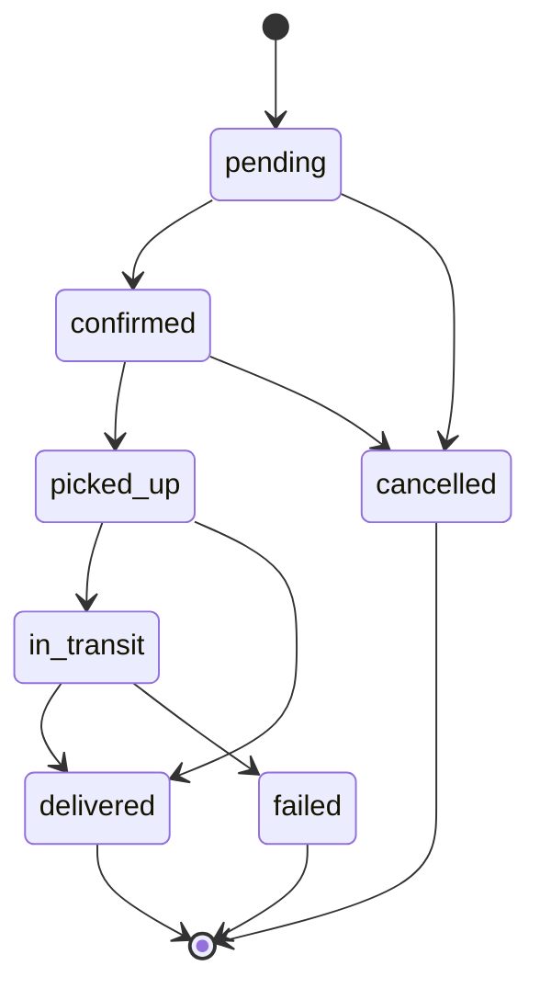

# 10. データモデル

📍 [目次](README.md) ▶ 10. データモデル

このページの読者：MEGURU の **DB スキーマを理解したい開発者**。

実体：[migrations/001_initial.sql](../../migrations/001_initial.sql) ほか。

---

## 10.1 ER 図

```mermaid
erDiagram
    TENANTS ||--o{ DRIVERS : has
    TENANTS ||--o{ STOPS : has
    TENANTS ||--o{ STOP_CONNECTIONS : has
    TENANTS ||--o{ ROUTES : has
    TENANTS ||--o{ SHIPMENTS : has
    TENANTS ||--o{ DISPATCHES : has
    TENANTS ||--o{ TENANT_PRICING : has
    TENANTS ||--o{ SHIPPER_DISCOUNTS : has
    TENANTS ||--o{ API_KEYS : has

    ROUTES ||--o{ ROUTE_STOPS : contains
    STOPS  ||--o{ ROUTE_STOPS : appears_in

    STOPS ||--o{ STOP_CONNECTIONS : from
    STOPS ||--o{ STOP_CONNECTIONS : to

    SHIPMENTS ||--o{ SHIPMENT_LEGS : split_into
    ROUTES    ||--o{ SHIPMENT_LEGS : runs
    STOPS     ||--o{ SHIPMENT_LEGS : from
    STOPS     ||--o{ SHIPMENT_LEGS : to

    DISPATCHES ||--o{ STOP_LOGS : produces
    DISPATCHES ||--o{ SHIPMENT_REPORTS : produces
    DRIVERS    ||--o{ DISPATCHES : drives
    ROUTES     ||--o{ DISPATCHES : runs
```

---

## 10.2 テーブル一覧

| テーブル | 役割 |
|---|---|
| `tenants` | 運営事業者 |
| `drivers` | ドライバー |
| `stops` | バス停 |
| `stop_connections` | バス停間の接続（グラフの辺）|
| `routes` | ルート（朝便など） |
| `route_stops` | ルート内のバス停の順序 |
| `shipments` | 荷物 |
| `shipment_legs` | 荷物の区間（中継時は複数）|
| `dispatches` | 配車（ドライバー×ルート×日付）|
| `stop_logs` | バス停ごとの到着／出発ログ |
| `shipment_reports` | 個別荷物の集荷／配達報告 |
| `tenant_pricing` | テナントごとの料金設定 |
| `shipper_discounts` | 荷主への割引 |
| `api_keys` | 荷主用 API キー |
| `bridge_stop_links` | やさいバス→MEGURU バス停 ID マッピング（shadow 専用）|
| `bridge_order_links` | やさいバス→MEGURU 注文 ID マッピング（shadow 専用）|

---

## 10.3 マルチテナント（RLS）

全テーブルに `tenant_id` を持ち、PostgreSQL の Row Level Security で他テナントから不可視。

```sql
ALTER TABLE stops ENABLE ROW LEVEL SECURITY;
CREATE POLICY tenant_isolation ON stops
  USING (tenant_id = current_setting('app.tenant_id')::uuid);
```

API はリクエストごとに：

```sql
SET LOCAL app.tenant_id = '<TENANT>';
SELECT ... FROM stops WHERE ...;   -- RLS で自動絞り込み
```

---

## 10.4 主要テーブル詳細

### tenants

```sql
CREATE TABLE tenants (
    id          UUID PRIMARY KEY DEFAULT uuid_generate_v4(),
    name        TEXT NOT NULL,
    plan        TEXT CHECK (plan IN ('starter','standard','pro','enterprise')),
    active      BOOLEAN DEFAULT TRUE,
    created_at  TIMESTAMPTZ DEFAULT now()
);
```

### stops

```sql
CREATE TABLE stops (
    id              UUID PRIMARY KEY,
    tenant_id       UUID NOT NULL REFERENCES tenants(id),
    name            TEXT NOT NULL,
    address         TEXT NOT NULL,
    latitude        DOUBLE PRECISION NOT NULL,
    longitude       DOUBLE PRECISION NOT NULL,
    stop_type       TEXT CHECK (stop_type IN ('collection','delivery','transit','both','garage')),
    capacity_cases  INTEGER NOT NULL DEFAULT 100
);
```

### stop_connections（グラフの辺）

```sql
CREATE TABLE stop_connections (
    id              UUID PRIMARY KEY,
    tenant_id       UUID NOT NULL,
    from_stop_id    UUID NOT NULL REFERENCES stops(id),
    to_stop_id      UUID NOT NULL REFERENCES stops(id),
    days_of_week    JSONB DEFAULT '[]',
    transit_days    INTEGER DEFAULT 0,
    -- 002 で追加
    distance_m      INTEGER,
    cost_jpy        INTEGER,
    co2_g           INTEGER,
    active_from     DATE NOT NULL,
    active_until    DATE
);
```

### routes / route_stops

```sql
CREATE TABLE routes (
    id              UUID PRIMARY KEY,
    tenant_id       UUID NOT NULL,
    name            TEXT NOT NULL,
    days_of_week    JSONB DEFAULT '[]',
    departure_time  TIME NOT NULL,
    temperature     TEXT CHECK (temperature IN ('ambient','refrigerated','frozen')),
    capacity_cases  INTEGER DEFAULT 50,
    active          BOOLEAN DEFAULT TRUE
);

CREATE TABLE route_stops (
    id          UUID PRIMARY KEY,
    route_id    UUID REFERENCES routes(id) ON DELETE CASCADE,
    stop_id     UUID REFERENCES stops(id),
    sequence    INTEGER NOT NULL,
    UNIQUE (route_id, sequence)
);
```

### shipments / shipment_legs

```sql
CREATE TABLE shipments (
    id                  UUID PRIMARY KEY,
    tenant_id           UUID NOT NULL,
    external_order_id   TEXT,
    origin_stop_id      UUID NOT NULL REFERENCES stops(id),
    destination_stop_id UUID NOT NULL REFERENCES stops(id),
    scheduled_date      DATE NOT NULL,
    cases               INTEGER NOT NULL,
    container_size      TEXT CHECK (container_size IN ('small','medium','large','xlarge','xxlarge')),
    temperature         TEXT,
    status              TEXT CHECK (status IN ('pending','confirmed','picked_up','in_transit','delivered','cancelled','failed')),
    created_at          TIMESTAMPTZ DEFAULT now()
);

CREATE TABLE shipment_legs (
    id              UUID PRIMARY KEY,
    shipment_id     UUID REFERENCES shipments(id) ON DELETE CASCADE,
    leg_order       INTEGER NOT NULL,
    route_id        UUID NOT NULL REFERENCES routes(id),
    from_stop_id    UUID NOT NULL REFERENCES stops(id),
    to_stop_id      UUID NOT NULL REFERENCES stops(id),
    scheduled_date  DATE NOT NULL,
    status          TEXT,
    UNIQUE (shipment_id, leg_order)
);
```

### dispatches / stop_logs / shipment_reports

```sql
CREATE TABLE dispatches (
    id          UUID PRIMARY KEY,
    tenant_id   UUID NOT NULL,
    route_id    UUID NOT NULL REFERENCES routes(id),
    driver_id   UUID NOT NULL REFERENCES drivers(id),
    date        DATE NOT NULL,
    status      TEXT,
    UNIQUE (route_id, date)
);

CREATE TABLE stop_logs (
    id              UUID PRIMARY KEY,
    dispatch_id     UUID REFERENCES dispatches(id) ON DELETE CASCADE,
    stop_id         UUID REFERENCES stops(id),
    arrived_at      TIMESTAMPTZ,
    departed_at     TIMESTAMPTZ,
    cases_loaded    INTEGER DEFAULT 0,
    cases_unloaded  INTEGER DEFAULT 0
);

CREATE TABLE shipment_reports (
    id              UUID PRIMARY KEY,
    dispatch_id     UUID REFERENCES dispatches(id),
    stop_id         UUID REFERENCES stops(id),
    shipment_id     UUID REFERENCES shipments(id),
    cases_reported  INTEGER NOT NULL,
    report_type     TEXT CHECK (report_type IN ('pickup','delivery')),
    submitted       BOOLEAN DEFAULT FALSE
);
```

---

## 10.5 インデックス戦略

| インデックス | 用途 |
|---|---|
| `idx_stops_tenant` | テナントごとのバス停一覧 |
| `idx_stop_connections_tenant` | グラフ構築時の全件取得 |
| `idx_stop_connections_from`/`_to` | 隣接ノード探索 |
| `idx_shipments_tenant_status` | ステータス別一覧 |
| `idx_shipments_external` | 冪等性チェック |
| `idx_dispatches_driver_date` | ドライバー画面 |
| `idx_shipment_legs_route_date` | ルート×日付の集計 |

---

## 10.6 状態遷移図



`picked_up` 以降は **キャンセル不可**（既にトラックに乗ったため）。

---

## 10.7 やさいバス対応表（bridge）

詳細は [docs/bridge_mapping.md](../bridge_mapping.md) を参照。

| やさいバス | MEGURU |
|---|---|
| `dtb_order.id` | `shipments.external_order_id` |
| `dtb_order.order_status_id` (1〜13) | `shipments.status` (7値) |
| `dtb_order.farmer_bus_stop_id` | `shipments.origin_stop_id` (via `bridge_stop_links`) |
| `dtb_order.buyer_bus_stop_id` | `shipments.destination_stop_id` |
| `dtb_order_container.container_size_id` (1〜5) | `shipments.container_size` |
| `mtb_bus_stop.id` | `stops.id` (via `bridge_stop_links`) |
| 4 フラグの組合せ | `stops.stop_type` |
| `mtb_bus_stop_connect` | `stop_connections` |
| `mmtb_route` | `routes` |
| `mmtb_bus_area` / `mtb_cross_border_fee` | `tenant_pricing` |

---

## 10.8 容量見積もり

| 項目 | 1テナント想定 | 全体（10テナント） |
|---|---|---|
| stops | 数百 | 数千 |
| stop_connections | 数千〜数万 | 数十万 |
| routes | 数十 | 数百 |
| shipments | 月 1〜10 万 | 月 100 万 |
| shipment_legs | shipments × 1.5 平均 | 同上 |
| stop_logs | dispatches × stops/route | 月 100 万 |

→ Postgres 16 + Fly.io 標準プランで十分。1 年で 1〜10 GB 想定。

---

## 10.9 マイグレーションファイル

| ファイル | 内容 |
|---|---|
| [001_initial.sql](../../migrations/001_initial.sql) | 初期スキーマ全体 |
| [002_add_edge_cost_dimensions.sql](../../migrations/002_add_edge_cost_dimensions.sql) | distance_m / cost_jpy / co2_g 追加 |
| [003_bridge_support.sql](../../migrations/003_bridge_support.sql) | bridge_stop_links / bridge_order_links / watermark |

---

次：用語集・動画リストは [99_glossary.md](99_glossary.md)。
