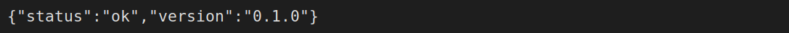
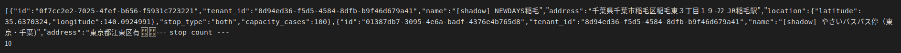

# 02. 5 分でやってみよう

📖 [目次](index.md) ｜ 前：[01](01_meguru_to_wa.md) ｜ 次：[03](03_dekiru_koto.md)

---

## このページのゴール

実際に MEGURU に「注文を入れて、ルートが自動で組まれる」のを **自分の目で確認** します。

> 💡 MEGURU は画面（GUI）ではなく **コマンドで操作するサーバ** です。難しそうに見えますが、 **このページのコマンドをコピペするだけ** で動きます。

🎥 **動画**：このページを最初から最後まで通したデモ（撮影予定 / `assets/videos/V2.mp4`）

---

## 0. 準備（最初の 1 回だけ）

MEGURU は **安河内の MacBook / 開発サーバで起動** している前提で書きます。

- サーバアドレス：例 `http://localhost:3000`
- 「自分でサーバを立てたい」場合は安河内に依頼してください

---

## 1. サーバが動いているか確認

ターミナル（黒い画面）を開いて、以下をコピペ：

```bash
curl http://localhost:3000/health
```

期待される画面：

```
{"status":"ok","version":"0.1.0"}
```

📸 

これが出れば **MEGURU が動いています**。お祝いです 🎉

---

## 2. デモ用の「お客様（運営事業者）」を作る

MEGURU はお客様ごとに **入れ物（テナント）** を作ります。

```bash
curl -X POST http://localhost:3000/admin/tenants \
  -H 'Content-Type: application/json' \
  -H 'X-API-Key: dev-noauth' \
  -d '{"name":"デモ会社","plan":"starter"}'
```

返ってくる中身（一部）：

```json
{
  "id": "01a2b3c4-...",
  "name": "デモ会社",
  "plan": "starter"
}
```

この **`id` をコピー** しておいてください。これから何度か使います。便宜上「会社ID」と呼びます。

> 💡 `plan` は `starter`（月3万）`standard`（月8万）`pro`（月20万）`enterprise`（個別）から選びます。

---

## 3. バス停を 3 つ登録する

「農家A」「中継ハブ」「お店B」の 3 か所を登録します。

> 以下の `<会社ID>` の部分を、上で取った id に **3 か所すべて置き換え** てください。

### 農家A（集荷地点）

```bash
curl -X POST "http://localhost:3000/stops?tenant_id=<会社ID>" \
  -H 'Content-Type: application/json' \
  -H 'X-API-Key: dev-noauth' \
  -d '{"name":"農家A","address":"千葉県","latitude":35.61,"longitude":140.10,"stop_type":"collection","capacity_cases":100}'
```

### 中継ハブ（積み替え地点）

```bash
curl -X POST "http://localhost:3000/stops?tenant_id=<会社ID>" \
  -H 'Content-Type: application/json' \
  -H 'X-API-Key: dev-noauth' \
  -d '{"name":"中継ハブ","address":"千葉県","latitude":35.64,"longitude":140.04,"stop_type":"transit","capacity_cases":500}'
```

### お店B（配達先）

```bash
curl -X POST "http://localhost:3000/stops?tenant_id=<会社ID>" \
  -H 'Content-Type: application/json' \
  -H 'X-API-Key: dev-noauth' \
  -d '{"name":"お店B","address":"東京都","latitude":35.66,"longitude":139.80,"stop_type":"delivery","capacity_cases":50}'
```

それぞれ返ってくる `id` を **メモ**（農家ID／ハブID／お店IDと呼びます）。

### 登録できたか確認

```bash
curl "http://localhost:3000/stops?tenant_id=<会社ID>" -H 'X-API-Key: dev-noauth'
```

📸 

3 件並んでいれば OK。

---

## 4. ルートを 2 本作る

### 朝便（農家A → 中継ハブ）

```bash
curl -X POST "http://localhost:3000/routes?tenant_id=<会社ID>" \
  -H 'Content-Type: application/json' \
  -H 'X-API-Key: dev-noauth' \
  -d '{"name":"朝便","days_of_week":["mon","tue","wed","thu","fri"],"departure_time":"08:00:00","temperature":"refrigerated","capacity_cases":50,"stops":["<農家ID>","<ハブID>"]}'
```

### 午後便（中継ハブ → お店B）

```bash
curl -X POST "http://localhost:3000/routes?tenant_id=<会社ID>" \
  -H 'Content-Type: application/json' \
  -H 'X-API-Key: dev-noauth' \
  -d '{"name":"午後便","days_of_week":["mon","tue","wed","thu","fri"],"departure_time":"13:00:00","temperature":"refrigerated","capacity_cases":50,"stops":["<ハブID>","<お店ID>"]}'
```

---

## 5. 「バス停同士の繋がり」を登録する

「農家A から ハブ に行ける」「ハブから お店B に行ける」を教えます。

```bash
curl -X POST "http://localhost:3000/connections/bulk?tenant_id=<会社ID>" \
  -H 'Content-Type: application/json' \
  -H 'X-API-Key: dev-noauth' \
  -d '{"connections":[
    {"from_stop_id":"<農家ID>","to_stop_id":"<ハブID>","days_of_week":["mon","tue","wed","thu","fri"],"transit_days":0,"active_from":"2026-01-01"},
    {"from_stop_id":"<ハブID>","to_stop_id":"<お店ID>","days_of_week":["mon","tue","wed","thu","fri"],"transit_days":0,"active_from":"2026-01-01"}
  ]}'
```

---

## 6. **いよいよ注文を入れる**

「明日、農家A から お店B に 3 ケース運んで」を MEGURU にお願いします。

```bash
curl -X POST "http://localhost:3000/shipments?tenant_id=<会社ID>" \
  -H 'Content-Type: application/json' \
  -H 'X-API-Key: dev-noauth' \
  -d '{"origin_stop_id":"<農家ID>","destination_stop_id":"<お店ID>","scheduled_date":"2026-05-13","cases":3,"container_size":"medium","external_order_id":"DEMO-001"}'
```

### 期待される画面

```json
{
  "id": "f1e2d3c4-...",
  "status": "pending",
  "legs": [
    { "leg_order": 1, "from_stop_id": "<農家ID>", "to_stop_id": "<ハブID>" },
    { "leg_order": 2, "from_stop_id": "<ハブID>", "to_stop_id": "<お店ID>" }
  ]
}
```

🎉 **`legs` が 2 つ** あることに注目。MEGURU が

> 「農家から直行便はない。中継ハブを経由すれば届く！」

と判断して、自動で **2 区間に分けて配送計画** を立てたわけです。これが MEGURU の中核機能。

📸 撮影候補：`assets/captures/07_shipment_create_2legs.png`

---

## 7. 注文の状態を見る

```bash
curl "http://localhost:3000/shipments/<上で返ってきた id>" -H 'X-API-Key: dev-noauth'
```

`status` の意味：

| 状態 | 意味 |
|---|---|
| `pending` | 受付済（まだ配車されていない）|
| `confirmed` | 配車確定 |
| `picked_up` | 集荷完了（農家から積み込んだ） |
| `in_transit` | 中継輸送中 |
| `delivered` | 配達完了 |
| `cancelled` | キャンセル済 |

---

## 8. キャンセルしてみる

```bash
curl -X PATCH "http://localhost:3000/shipments/<id>/cancel" \
  -H 'X-API-Key: dev-noauth'
```

もう一度 7 を実行すると `status` が `cancelled` になります。

> ⚠️ `picked_up` 以降（既にトラックに乗った後）はキャンセル不可。リアルな運用に合わせた仕様です。

---

## できたこと振り返り

このページで体験したこと：

1. ✅ MEGURU が動いていることを確認
2. ✅ お客様（テナント）を作った
3. ✅ バス停を 3 つ登録した
4. ✅ ルートを 2 本作った
5. ✅ バス停同士の繋がりを登録した
6. ✅ 注文を入れて、**2 区間に自動分割** されるのを見た
7. ✅ 注文の状態を確認した
8. ✅ キャンセルした

これが MEGURU の **基本動作の全部** です。

---

## つぎ

➡️ **[03. できること一覧](03_dekiru_koto.md)** に進む — 営業トークで使える「こんな使い方ができる」事例
